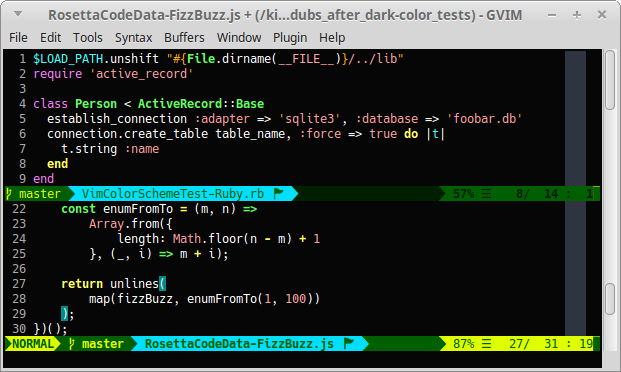

#################
Dubs Mescaline 🍄
#################

Clean, vibrant Vim status line.

*The Dubs Mescaline status line pairs well with the*
`Dubs After Dark <https://github.com/landonb/dubs_mescaline>`__
*color scheme.*

About This Plugin
=================

This plugin provides a simple, feature-rich status line:

- Shows [Vim mode] > [Git branch] > [(Optional) Clock] > [File name + flags] > [Cursor/File metrics]

- Utilizes the awesome `Powerline font <https://github.com/powerline/fonts>`__
  to render a clean, vibrant status line.

  - If you're looking for a great font that includes the Powerline
    glyphs, check out
    `Hack Nerd Font <https://github.com/ryanoasis/nerd-fonts/tree/master/patched-fonts/Hack>`__,
    "A typeface designed for source code."

- This plugin is a single ``autoload`` file that's easy to grok and hack.

- Inspired by these other great plugins:

  `Powerline
  <https://github.com/powerline/powerline>`__

  `vim-airline
  <https://github.com/vim-airline/vim-airline>`__

  `lightline
  <https://github.com/itchyny/lightline.vim>`__

  `lualine.nvim
  <https://github.com/nvim-lualine/lualine.nvim>`__

  `vim-flagship
  <https://github.com/tpope/vim-flagship>`__

  - But I baked my own because I didn't want anything fancy,
    and I wanted to add a clock.

Configuration
=============

This plugin is inactive by default.

Call its ``Setup({opts})`` function to start and stop it.

E.g., here's how you might install and configure the plugin
from Lua using |lazy.nvim|_::

  {
    "landonb/dubs_mescaline",

    config = function()
      -- These are the default values if you
      -- don't specify them.

      vim.fn['embrace#mescaline#Setup']({
        clock_enable = 1,
        clock_rate = 2500,
        git_icon = '',
      })
    end,
  },

Or from your ``.vimrc``::

  " These are the default values if you
  " don't specify them.
  call g:embrace#mescaline#Setup({
    \ 'clock_enable': 1,
    \ 'clock_rate': 2500,
    \ 'git_icon': '',
    \ })

Some notes:

- You'll notice that the ``git_icon`` symbol probably does not render in your
  browser. But it should render in (Neo)Vim if you use a font from
  `Nerd Fonts <https://github.com/ryanoasis/nerd-fonts/>`__. (Or you can pick
  your own character.)

- When ``clock_enable`` is truthy, the ``clock_rate`` controls how often the
  background timer runs. The background timer is used to update the status
  bar clock, so that if you're not using (Neo)Vim, the clock still updates
  (otherwise Vim only refreshes the status line when you interact with the
  buffer). If you set a longer clock rate, the status line clock may not
  update for that many milliseconds after the minute changes.

Requirements
============

The branch name used in the status line is fetched using ``vim-fugitive``:

https://github.com/tpope/vim-fugitive

Installation
============

Install this plugin like you would any Neovim or Vim plugin —
probably using |lazy.nvim|_ or |vim-plug|_.

.. |lazy.nvim| replace:: ``lazy.nvim``
.. _lazy.nvim: https://github.com/folke/lazy.nvim

.. |vim-plug| replace:: ``vim-plug``
.. _vim-plug: https://github.com/junegunn/vim-plug

