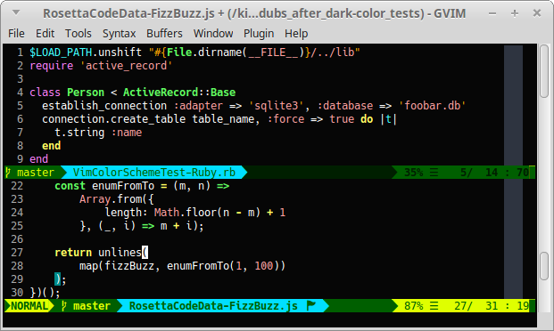

############################
Dubs Vim |em_dash| Mescaline
############################

.. |em_dash| unicode:: 0x2014 .. em dash

Clean, vibrant Vim status line.

*The Dubs Mescaline status line and* `Dubs After Dark <https://github.com/landonb/dubs_mescaline>`__ *color scheme.*

About This Plugin
=================

This plugin provides a simple, elegant status line:

- Shows [Vim mode] > [Git branch] > [File name + flags] > [Cursor info]

- Utilizes the awesome `Powerline font <https://github.com/powerline/fonts>`__
  to render a clean, vibrant status line.

  - If you're looking for a great font that includes the Powerline
    glyphs, check out `Hack <https://github.com/source-foundry/Hack>`__,
    "a typeface designed for source code."

- Single file plugin; easy to hack.

- Inspired by other great plugins that just didn't cut it for me:

  `Powerline
  <https://github.com/powerline/powerline>`__

  `vim-airline
  <https://github.com/vim-airline/vim-airline>`__

  `lightline
  <https://github.com/itchyny/lightline.vim>`__

Installation
============

Installation is easy using the packages feature (see ``:help packages``).

To install the package so that it will automatically load on Vim startup,
use a ``start`` directory, e.g.,

.. code-block:: bash

    mkdir -p ~/.vim/pack/landonb/start
    cd ~/.vim/pack/landonb/start

If you want to test the package first, make it optional instead
(see ``:help pack-add``):

.. code-block:: bash

    mkdir -p ~/.vim/pack/landonb/opt
    cd ~/.vim/pack/landonb/opt

Clone the project to the desired path:

.. code-block:: bash

    git clone https://github.com/landonb/dubs_mescaline.git

If you installed to the optional path, tell Vim to load the package:

.. code-block:: vim

   :packadd! dubs_mescaline

Just once, tell Vim to build the online help:

.. code-block:: vim

   :Helptags

Then whenever you want to reference the help from Vim, run:

.. code-block:: vim

   :help dubs-mescaline

